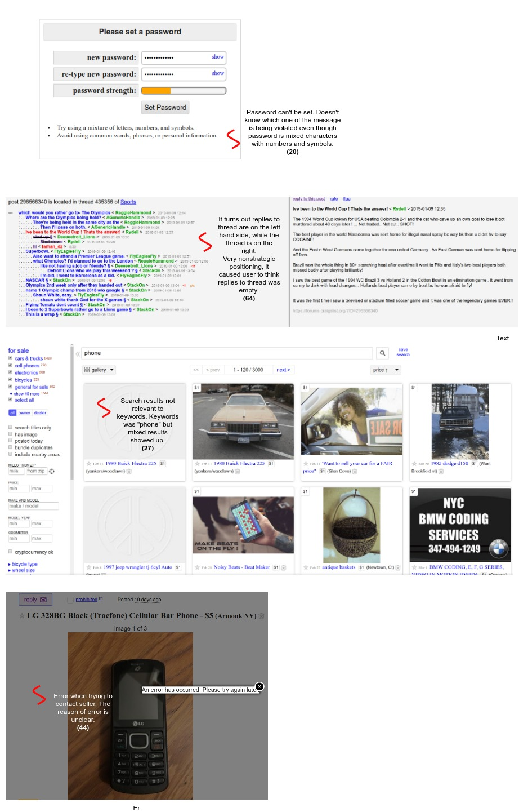
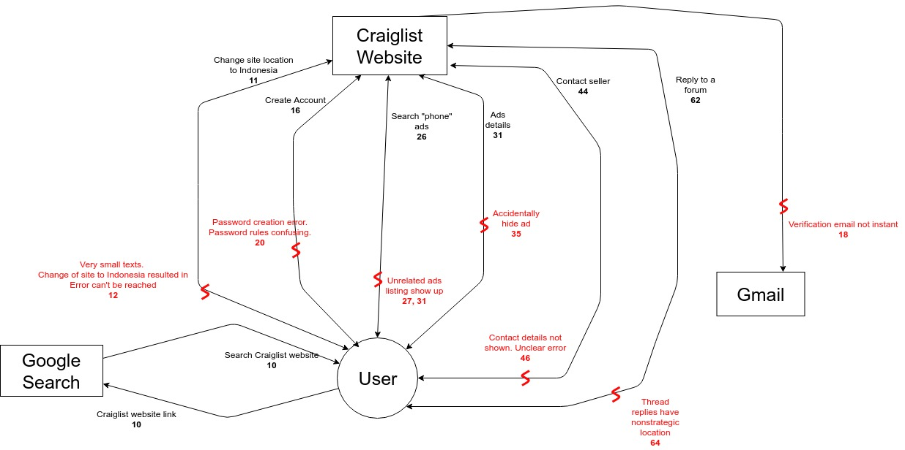

# Contextual Inquiry and Analysis
## Device/ App/ Website Description
Craiglist is a website to advertise used items for sale or services. You can find a listing for almost anything on Craigslist—jobs, apartments, garage sales, used cars, personal ads, and a whole lot more.

Craiglist holds statistics as one of the most visisted English language websites, 8 billion page views per month, with their ads classified for more than 450 cities worldwide. Most of Craiglist ads are from US cities, as it was founded in San Francisco. Although, each Craiglist city is seperated into each own site - with a different subdomain, corresponding to the city name. *e.g. New York Craiglist site would be newyork.craigslist.org.*

Other than ads, Craiglist also hold public free discussion forums ranging from simple hobby topics like sports and gardening to advanced tech geek android and linux.


Just note that Craiglist isn't an e-commerce website, you cannot buy items through the website, it doesn't provide any payment gateway or shipping services. You must contact the item owner if you're interested in the listing.


## Instruction Script
1. Find a working Craiglist site
2. Create an account
3. Find the details of a seller selling mobile phone with the lowest price
4. Reply to a discussion forum you may be interested in
5. Flag an already flagged thread as spam
## User Description
- The chosen user is a mid teen school student
- The user uses the internet daily, most of what is school work, browsing articles, and light social media usage
- The user is aware of ad listing sites, but have never used it
- The user is aware of e-commerce websites, and have used it occasionally by parents permission
- The user understands the English language well
## Transcript

```
1. Adis     :   Han, kamu biasanya kalau beli barang selain ke tokonya langsung, bagaimana?
2. Farhan   :   Beli lewat Tokopedia atau Bukalapak mas.
3. Adis     :   Ohh.. Itu rata-rata barangnya baru kan, terus juga bisa langsung bayar dan ship lewat online.
4. Farhan   :   Iya mas, makanya lebih gampang.
5. Adis     :   Kamu tau aplikasi untuk cari barang-barang bekas yang sedang dijual? Tapi yang harus ketemu langsung sama penjualnya.
6. Farhan   :   Hmmm.. Seperti OLX itu mas?
7. Adis     :   Iya. Ini namanya Craiglist. Ndak sekadar upload/ cari barang, tapi juga ada forum discussion-nya.
8. Farhan   :   Aku belum pernah dengar.
9. Adis     :   Nah, sip deh. Mas minta tolong kamu main-main sebentar di aplikasi ini. Ini untuk menuhin tugas kuliah ku, entar aku suru kamu ngelakuin beberapa hal di aplikasinya, tapi caranya ndak aku beritahu, kamu harus cari tahu sendiri. Pake laptop ku ini. Buka browser terus kamu coba cari website Craiglist.
10. Farhan  :   Ini langsung cari di Google mas? *mengetik Craiglist di Google, klik link pertama yang muncul* Yang ini ta mas web-nya... Kok websitenya aneh mas, kayak web zaman dulu.
11. Adis    :   Iya yang itu. Itu lokasi mu sudah bener belum? Kalau belum lokasiya gantien ke Craiglist Indonesia.
12. Farhan  :   Emang sekarang dimana.. Oh ini New York City. Banyak banget mas tulisannya kecil-kecil.. Location..location.. Ini ada Indonesia. 
                Ndak bisa load site-nya mas. "Craiglist Indonesia can't be reached" tulisannya.
13. Adis    :   Yaudah. Pakai yang sebelumnya aja, yang penting bisa digunakan.
14. Farhan  :   Ini aku zoom ya mas. Gak keliatan tulisannya.
15. Adis    :   Sekarang bikin akun Craiglist biar kamu bisa aktif.
16. Farhan  :   Ini gak bisa login pakai Google ta?
17. Adis    :   Pakai gmail mu bisa kok
18. Farhan  :   Loh kalau aku main game itu biasanya login pake facebook atau google langsung bisa, gak usah daftar dulu... Yawes tak pake emailku. 
(sedang mengetik email)
Ini habis masukkin email muncul pesan "A verification email has been sent to your address." Ok aku cek email ku dulu. 
(5 menit kemudian, click link di email)
19. Adis    :   Udah masuk ta emailnya? Yang kamu lakukan apa sekarang?
20. Farhan  :   Ini kata emailnya aku harus masukkin password untuk akun ku. 
(redirect ke halaman password) 
Aku udah masukkin password lumayan dengan berbagai karakter yang berbeda tetapi masih ditolak. Ada 2 tulisan yang muncul dan aku ndak tahu yang mana yang salah.
21. Adis    :   Oke. Apa yang kamu lakukan biar password mu diterima.
22. Farhan  :   Tak masukkin password yang random aja wes. Ini tak catet ae ya passwordnya.
23. Adis    :   Iya. Sampai sini masih gampang kan?
24. Farhan  :   1. Aku tadi mau milih wesbite Craiglist Indonesia tapi ndak kebuka. Kayaknya keblokir deh.
                2. Bikin akun membingungkan karena peraturan password sudah terpenuhi tapi masih tetap ditolak.
25. Adis    :   Kamu coba cari iklan HP dengan harga termurah.
26. Farhan  :   Ok. Hmmm... Pake search ta mas? Ini aku search langsung aja ya... Kalo aku ngetik "phone" muncul HP, tapi kayaknya ini belum yang termurah. Oh ada pilihan urutan disini, yang harga ada dua. Dari yang termahal atau termurah. Termurah tak coba.
27. Farhan  :   Aku bingung.. ini banyak iklan yang gak sesuai dengan kata kunci "Phone". Bahkan di judul iklannya ndak mengandung "Phone" sama sekali. Ada iklan mobil, buku comic, keranjang. hahahaha sulit banget.
28. Adis    :   Search kategori di-limit aja. Biar gak semuanya muncul.
29. Farhan  :   Ok. Tak pencet cell phones. Sudah muncul ini. Tak urutin lagi harganya.
30. Adis    :   HP apa yang termurah?
31. Farhan  :   Ini bukan iklan yang paling atas.. aku agak scroll kebawah soalnya yang awal-awal kebanyakan aksesoris. Kalo ini HP jadul merk LG, harganya $5.
32. Adis    :   Lokasi iklannya dimana?
33. Farhan  :   Kayaknya di Arkmonk NY.
34. Adis    :   Kamu cari info penjualnya. Seolah-olah ingin beli HP itu.
35. Farhan  :   Ok... Kok tak pencet malah hilang mas?
36. Adis    :   Mana? Oh itu kayaknya ke hide.
(ternyata yang dipencet tombol delete)
37. Farhan  :   Tak search lagi... Tetap ndak ada mas. Tapi diatas ada menu baru. Oh hidden ya.
38. Adis    :   Bisa kamu unhide gak?
39. Farhan  :   Kalo aku buka new tab, halamannya tetap sama... Oh ini baru bisa, gak bisa new tab ternyata.
40. Adis    :   Kamu sekarang berupaya apa?
41. Farhan  :   Ini mau mencet tombol "restore this posting".
41. Adis    :   Ya. Kalau sudah, kamu ke iklannya lagi.
42. Farhan  :   Sudah mas. Aku cari-cari kok ndak ada info penjualnya mas. Biasanya kan ada nomer HP, nama, atau email.
43. Adis    :   Iya. Di Craiglist memang ndak ditampilin... Untuk terhindar dari spam. Tapi ada cara untuk menghubungi lewat Craiglist langsung. Kamu sekarang coba cari itu.
44. Farhan  :   Ndak rapi banget sih. Bingung aku sama tulisan, tombol nya. Wkwkwkwk. Kayaknya tombol reply ya mas? ... Gak bisa mas. Muncul pop up tapi tulisannya error.
45. Adis    :   Errornya apa?
46. Farhan  :   Ndak ada penjelasannya... Sek tak coba refresh. Hahaha tetap gak bisa mas. Tulisannya "An error has occurred. Please try again later".
47. Adis    :   Tadi caramu untuk mencari detail iklan HP termurah sulit ndak?
48. Farhan  :   Iya dan ndak. Sudah bisa langsung di search. Tapi banyak iklan yang gak sesuai. Pas sudah di halaman iklan berantakan banget. Tak kira iklannya langsung di klik langsung bisa dibuka. Ternyata kepencet tombol delete tadi ilang wkwkwkwk.
49. Adis    :   Oke. Tadi aku sempat bilang ada halaman forum kan. Hobby mu apa Han?
50. Farhan  :   Olahraga.
51. Adis    :   Sekarang kamu cari forum olahraga yang kamu suka, terus reply di forumnya. Kalo ada kesulitan bilang aja.
52. Farhan  :   Oke. Ini di halaman awal udah tersedia link sports. Isinya benar-benar campur jadi satu. Ndak kayak yang iklan tadi, tadi yang HP kan masuk cell phone. Ini sports aku ndak tau mana yang sepak bola, mana yang basket. Dan ada beberapa yang isinya aneh-aneh mas wkwkwk. Pantas keblokir yang Indonesia.
53. Adis    :   Kamu bisa search keywordnya kok.
54. Farhan  :   Oh yaa.. ada ini.
55. Adis    :   Kamu mau cari apa?
56. Farhan  :   Mau cari obrolan sepak bola. Ini aku search "soccer".
57. Adis    :   Pilih satu thread yang sekiranya kamu suka.
58. Farhan  :   Ini ada thread tentang "world cup". Aku lihat yaa.
59. Adis    :   Yaa. Reply di threadnya ada berapa?
60. Farhan  :   Gak tau mas.. Gak ada tulisannya blas. Kosongan gitu kecuali deskripsi threadnya.
61. Adis    :   Coba tunjukkin aku cara nambahin reply. 
62. Farhan  :   Oh kayak komen di thread? ... (Farhan sedang mencet link 'reply to this post')

                Ini tak isi sembarang ya mas... Loh ndak muncul mas yang tak isi. Threadnya masih kosong, padahal udah aku refresh.
63. Adis    :   Error lagi ta?
64. Farhan  :   Ndak kok... Oalahh, ternyata di sebelah kiri mas komen threadnya. Ini ada namaku. Tak kira itu judul thread yang lain hahahaha. 

(Saya baru tahu ternyata komen thread berada di sebelah kiri hehehe)
65. Adis    :   Oke-okee.
66. Adis    :   Mumpung lagi ada di halaman forum, sekarang cari thread yang ratingnya jelek, terus kamu flag sebagai spam.
67. Farhan  :   Cara tahu ratingnya jelek gimana? Ada bintangnya ta?
68. Adis    :   Uhhh.. coba cari angkanya.
69. Farhan  :   Ini ada -9, berarti jelek ya? Wkwkwkwk. Langsung aku flag mas?
70. Adis    :   Bisa ndak?
71. Farhan  :   Tak centang Spam, bisa mas.
72. Adis    :   Kamu mau ndak pakai Craiglist kalo mau cari kebutuhan barang?
73. Farhan  :   Kalo masalah tampilannya aku biasa aja. Iklan barangnya juga banyak banget. Tapi kalo forum kayaknya gak deh, ndak paham maksud orang-orang post disitu.
74. Adis    :   Siip. Udah Han, makasih udah mau nyoba Craiglist 
75. Farhan  :   Oke Mas, sama-sama.
```

## Models and Annotations
### Artifact Model

### Flow Model

### Cultural Model

## Do's and Don't's
### Do's
- DO give attractive scheme
- DO fix content layout
- DO provide user friendly errors

### Don't's
- DON'T have illicit content
- DON'T have possible scam of ads
- DON'T have spam of ads

# References

- *4th Meeting, Contextual Analysis, Powerpoint Slide*

# Remarks
> * Thanks for completing all the parts in this assignment. Well done!
> * One little note: You should not reveal or expose the participant's name on the report.

| Working Days | Commits before D | Commits after D | Presentation (80%) | Repo (20%) | Total |
|:------------:|:----------------:|:---------------:|:------------------:|:----------:|:-----:|
| 1            | 1                | 0               | 83                 | 75,5       | 81,5  |
